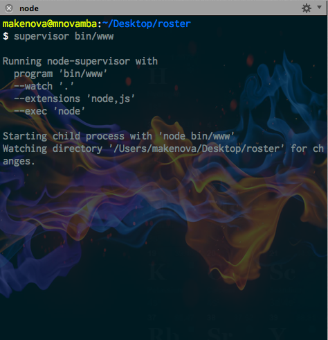
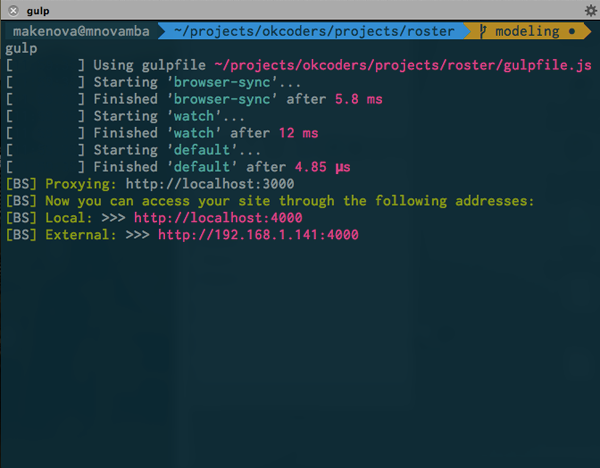

# OKCoders Roster

A roster project to stave off boredom for advanced students in OKCoders

## Run
Below, I have provided two ways to run the application. One is simple but is
slightly less convenient and the other requires more initial setup but will
make working for extended periods of time less tedious.

### Simple
The following instructions will run the application so you can get started
developing immediately.
 * install dependencies
  * `npm install --production`
 * run the node server
  * `npm start`

### Advanced
If you setup the project as described above, you will need to restart the node
server every time you change server code (Anything not in the public or views
directory) and refresh the browser window every time you change client side code.
For slightly better development experience, you can install all the dependencies,
including the dev-dependencies, with the following command:

    npm install

You will also need to install [`supervisor`](https://github.com/isaacs/node-supervisor)
globally with:

    npm install -g supervisor

run your app with `supervisor` instead of `node` and it will watch your project
folder and restart the server when it detects changes. Start the server
with the following command **instead** of `npm start`

    supervisor bin/www

Install [`browser-sync`](https://github.com/shakyShane/browser-sync) globally with:

		npm install -g browser-sync

BrowserSync will run a proxy in front of your application which will watch
for changes to files you specify and automatically refresh the browser. In a
separate command line window/tab, run `gulp` which in turn will run
`browser-sync`.

    gulp

BrowserSync should automatically launch your site locally on the port that is
specified in the gulpfile e.g. http://localhost:4000 and any changes to the files
that are being watched should trigger a refresh of the browser.

## TODO

There are essentialy 3 views for this app. The about/index page, the class page, and the person details page

- [ ] add about page (which will be the index page).  The index, which gives a description of the roster/alumni page, and two drop down inputs for year, and semester, which will load the class page.
- [ ] add class page. This will still have the year and semester input buttons at the top, but then will have the details for the class, which includes a description of the class, two boxes underneath the description with the professor and TA. Below those two boxes will be 4 boxes across with the students in the class
- [ ] A person details page, this will probably be a closable pop-up on the current page, that will give details on any picture clicked on the page. Most likely the details for the students, professor, and TA will be the same, but different views may be necessary depending on the attributes within each object.

